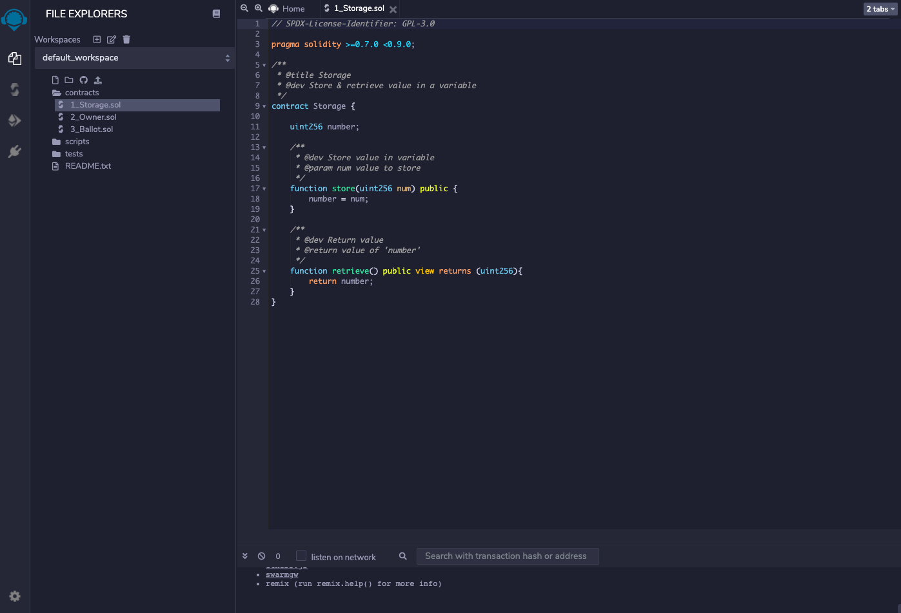
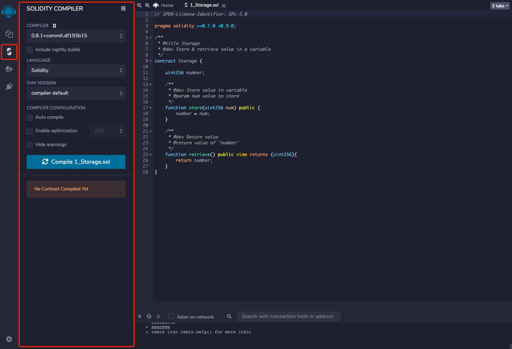

# Remix

[Remix](https://remix.ethereum.org/) 是在线的合约开发和部署工具。

## 首先打开 `Remix` 页面


左侧文件浏览器内，存在示例项目 default_workspace。项目下包含 3 个文件夹：

* contracts：存放合约文件。
* scripts：存放脚本文件。
* tests：保存测试文件。

我们可以参考示例项目创建新的项目。

## 编写合约

点击文件，比如 `1_Storage.sol`，可在右侧编辑内容。



## 编译合约

1. 点击左侧按钮，切换到编译界面；
2. 设置相关编译选项；
3. 点击编译按钮进行编译。



如果需要编译其他合约，切回文件浏览器然后选中新的合约，再切到编译界面进行编译。

## 部署合约

要将编译后的合约部署到链上，需要借助浏览器钱包插件。以 `MetaMask` 为例。

1. 浏览器安装 `MetaMask` 插件，设置网络信息，设置完成后保存。

* 主网
```
rpc: https://rpc.coinex.net
chainID: 52
symbol: CET
explorer: https://www.coinex.net
```


* 测试网
```
rpc: https://testnet-rpc.coinex.net
chainID: 53
symbol: tCET
explorer: https://testnet.coinex.net
```

2. 返回 `Remix` 界面。

* 点击左侧按钮，切换到部署界面；
* 环境选择 `Injected Web3` ，由 `MetaMask` 提供执行环境；
* 点击部署按钮。


在 `MetaMask` 确认后合约就部署上链了。

## 合约交互

合约部署成功后，`Deployed Contracts` 下方可以看到已部署的合约。展开合约，点击按钮调用合约方法。

与合约的交互区分写入数据和读取数据，写入数据称为交易，读取数据称为调用。

* Transactions：根本上改变了网络的状态，可以是普通交易，也可以是部署或者调用合约。执行交易需要花费Gas，并需要等待一定时间交易才上链。每一交易拥有唯一交易hash。
* Calls：在网络中执行代码，只读取数据。调用不需要花费Gas。

下面图中，黄色按钮是发起一笔交易，蓝色按钮是发起一次调用。


