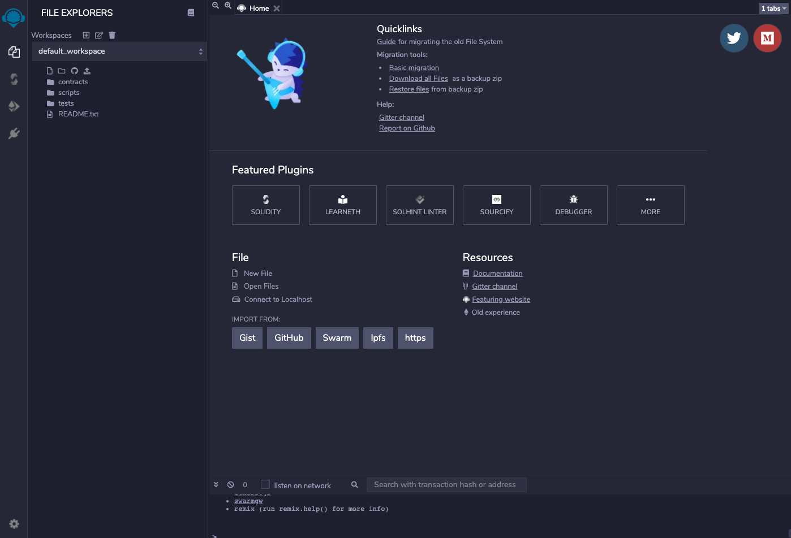
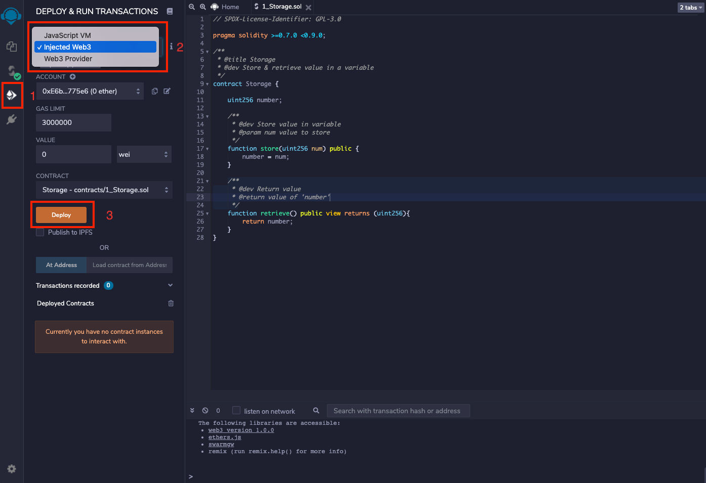
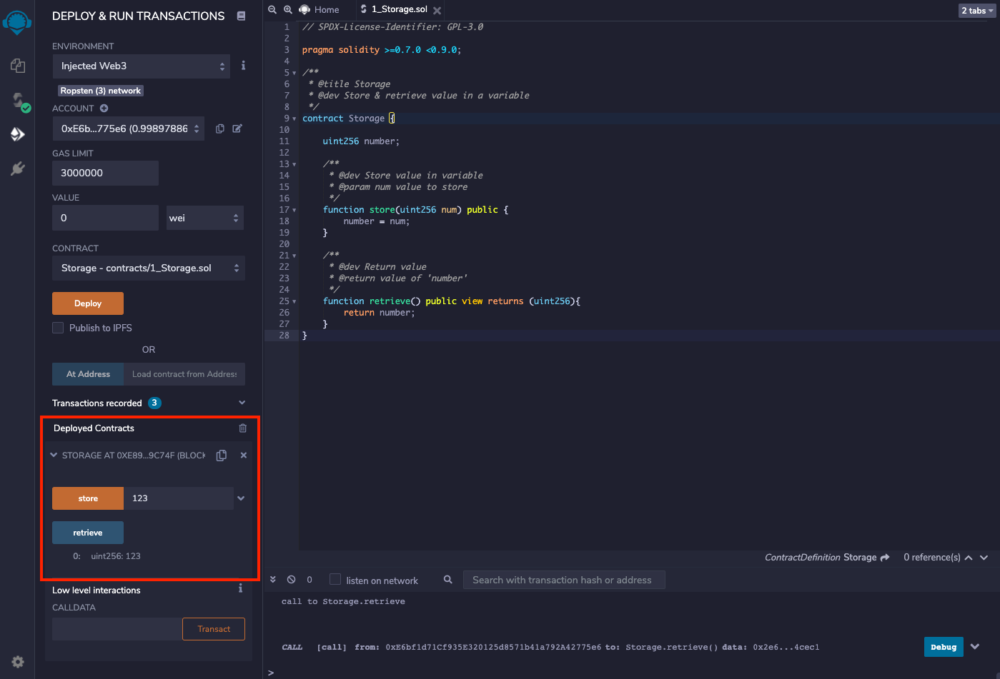

# Remix

[Remix](https://remix.ethereum.org/) is an online tool for contract development and deployment.

## Firstly, go to `Remix`



In the left file browser, there are 3 folders under the example project default_workspace:

* contracts：For contract file storage.
* scripts：For script file storage.
* tests：For test file storage.

We can refer to the sample project to create a new project.

## Edit Contract

Click file, such as `1_Storage.sol`, contents are editable on the right side.


## Compile Contract

1. Click the left button to switch to Compile interface;
2. Set related compilation options;
3. Click the compile button to compile.


If you need to compile another contract, you must switch back to the file browser, select a new contract, and then switch to `Compile` interface to compile.

## Deploy Contract

To deploy a compiled contract on chain, a browser wallet plug-in is required. Taking `MetaMask` for instance:

1. Install `MetaMask` plug-in on browser, set network information, and save the above setting.

* Mainnet

```
rpc: https://rpc.coinex.net
chainID: 52
symbol: CET
explorer: https://www.coinex.net
```


* Testnet

```
rpc: https://testnet-rpc.coinex.net
chainID: 53
symbol: tCET
explorer: https://testnet.coinex.net
```

2. Switch back to `Remix` interface.

* Click the left button to switch to Deploy interface;
* Select 'injected Web3' and allow `MetaMask` to provide the execution environment;
* Click the deploy button.



The contract is ready to be deployed on chain once `MetaMask` is confirmed.

## Interaction

With the contract deployed successfully, the deployed contract can be viewed under `Deployed Contracts`. Open contract and click the button to invoke contract method.

The interaction with the contract differentiates between writing data and reading data: Writing data is called a transaction, while reading data is defined as a call.

* Transactions: Fundamentally, it changes the state of the network. It can be a normal transaction, or a contract that is deployed or invoked. It takes gas to execute a transaction, and a certain amount of time for a transaction to be uploaded. Each transaction has a unique transaction hash.
* Calls: It does not cost gas to execute the code on the network and just reads data.

In the figure below, the yellow button initiates a transaction and the blue button initiates a call.


