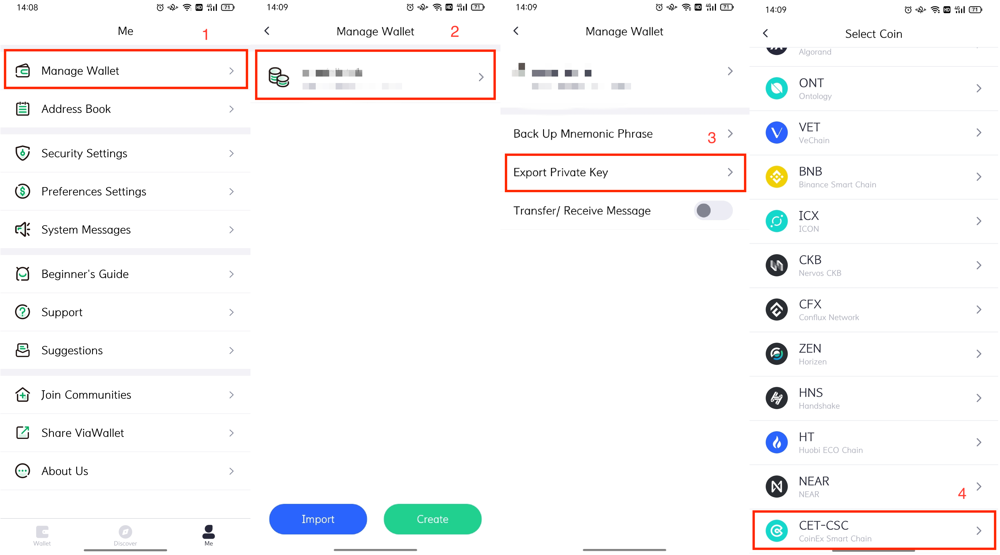

# FAQ

## Can validator's address, staker's address and reward receipt address be different?

`CSC` separates validator's address, staker's address and reward receipt address, they can be different。
Because the block needs to be signed, the `keystore` and password to the validator's address must be placed on the server.
Any address can stake to a validator. After the staker's address unstake and withdraw his staking, the staked `CET` will be returned to the original staker's address.
The reward of the validator will be uniformly allocated to the reward receipt address set by the validator, and only the reward receipt address can withdraw the reward.

> We suggest that the node builder separates validator's address and staker's address, so that the `keystore` and password of the staker do not need to be stored on the server, and there is no need to worry about the loss of the staker after the server is hacked.

## Can a staker's address be the CET address in the Coinex exchange?

No. Validator's address, staker's address and reward receipt address can't be the address in the Coinex exchange. You need to transfer your `CET` to an address on the `CSC` where you have the secret key.

## How to stake？

To make it easier for users to stake, `ViaWallet` is developing related features. In addition, you can stake via command line operations, refer to [command-line operations](/validator_cli.md).

## How to generate a keystore file by importing a private key?

`cetd` needs `keystore` file to send transactions, In addition to creating a new address, you can also export the private key of a created address from `ViaWallet` to create `keystore` file.

First, export the private key from `ViaWallet` and save it to a file.


Then import the private key from the command line:
```
$ cetd account import YOUR-PRIVATE-KEY-FILE --datadir YOUR-KEYSTORE-PATH

INFO [07-03|00:03:06.072] Maximum peer count                       ETH=200 LES=0 total=200
INFO [07-03|00:03:06.080] Set global gas cap                       cap=25000000
Your new account is locked with a password. Please give a password. Do not forget this password.
Password:               # input keystore password
Repeat password:        # input keystore password again
```
- `YOUR-PRIVATE-KEY-FILE` fill in the private key file
- `YOUR-KEYSTORE-PATH` fill in the directory in which to save the `keystore` file
- When you meet error like `Fatal: Failed to load the private key: invalid character '2' at end of key file`, delete '0x' at the beginning of the private key
- The generated `keystore` file will be in `YOUR-KEYSTORE-PATH/keystore` with the file name like `UTC--2021-07-02T16-03-11.895849700Z--YOUR-ADDRESS`

## Can the validator node use the fast mode?

Yes.

## How to check node synchronization status?

After the node is started, you can see through the log that the node is synchronizing data in batches.

In full synchronization mode, batch synchronization logs are as follows:
```
INFO [07-20|14:52:01.019] Imported new chain segment               blocks=2048  txs=40  mgas=0.344  elapsed=1.189s    mgasps=0.290  number=545319 hash="6a6ccc…9927c5" age=2d20h36m dirty=1.52MiB
INFO [07-20|14:52:02.400] Imported new chain segment               blocks=2048  txs=30  mgas=0.000  elapsed=1.359s    mgasps=0.000  number=547367 hash="a1808d…a1cca5" age=2d18h54m dirty=1.49MiB
```

In fast synchronization mode, batch synchronization logs are as follows:
```
INFO [07-20|14:16:45.824] Imported new block headers               count=192 elapsed=60.650ms    number=576 hash="70b7f1…134b31" age=3w17h58m
INFO [07-20|14:16:45.848] Imported new block receipts              count=199 elapsed=59.555ms    number=199 hash="70ce80…9d43c0" age=3w18h17m size=125.42KiB
INFO [07-20|14:16:45.868] Imported new state entries               count=656 elapsed=178.538ms   processed=656 pending=1608 trieretry=0 coderetry=0 duplicate=0 unexpected=0
INFO [07-20|14:16:45.870] Imported new block headers               count=192 elapsed=44.446ms    number=768 hash="5bb863…fb1db2" age=3w17h49m
```

When the nodes are synchronized to the latest height, you can see logs that synchronize the latest block by block:
```
INFO [07-20|14:36:06.014] Imported new chain segment               blocks=1  txs=0 mgas=0.000 elapsed="508.412µs" mgasps=0.000  number=627329 hash="09ea78…778e18" dirty=350.97KiB
INFO [07-20|14:36:09.017] Imported new chain segment               blocks=1  txs=0 mgas=0.000 elapsed="514.204µs" mgasps=0.000  number=627330 hash="d5fe32…8c27b2" dirty=350.97KiB
```

## How to query the block height of a node?

By querying the block height of a node and comparing it with the browser data, we can find out whether the node has been synchronized to the latest block height.

In addition to looking at the node logs, you can also check the height of your node with the `curl` command.
```shell
curl -X POST --data '{"jsonrpc":"2.0","method":"eth_blockNumber","params":[],"id":52}' -H "Content-Type: application/json" "http://127.0.0.1:8545"
```

Or via `attach` command and go to the command line console:
```
$ cetd attach data/cetd.ipc 
Welcome to the Geth JavaScript console!

instance: cetd/v1.0.0-stable-dfe1768e/linux-amd64/go1.15.6
at block: 455139 (Wed Jul 14 2021 15:06:32 GMT+0800 (CST))
 datadir: /root/workspace/csc-run-fullnode/data
 modules: admin:1.0 debug:1.0 eth:1.0 miner:1.0 net:1.0 personal:1.0 rpc:1.0 senatus:1.0 txpool:1.0 web3:1.0

To exit, press ctrl-d
> eth.blockNumber
455141
```

## How to unstake and withdraw the staking?

To make it easier for users to unstake and withdraw the staking, `ViaWallet` is developing related features. In addition, you can do it via command line operations, refer to [command-line operations](/validator_cli.md).

## When can I unstake? 

You can unstake at any time after you stake.

## Can I unstake only part of my staking?

Each time you unstake, you can only unstake all the staking you have staked to a certain validator.

## How long can I withdraw my staking after unstaking?

You need to wait for 86,400 blocks to withdraw your staking. Based on the current 3s block time, it probably needs to wait for 3 days.

## How often can I withdraw my reward?

It must be more than 28,800 blocks since you withdrawn reward last time.

## How to unjail a node?

If a node had been jailed, the first thing to do is investigate the cause. Restart the node after you fix the problem, and unjail the node through command line operation after the node is up and running properly and has been synchronized to the latest height.

## gasprice

`CSC` limits the transaction minimum gasprice to 500GWEI.
