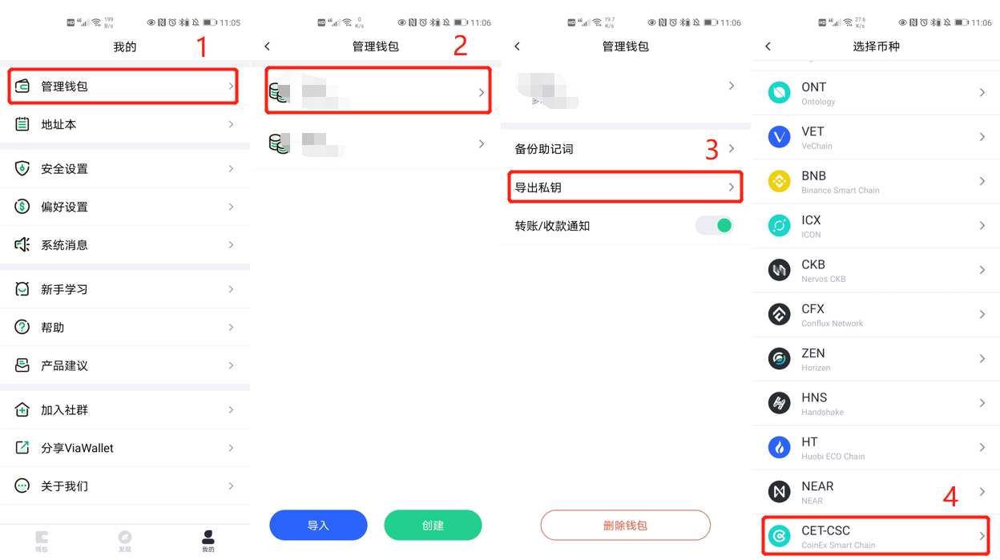

# 常见问题

## 验证节点地址、质押地址、收益接收地址可以不同吗？

`CSC`将验证节点地址、质押地址、收益接收地址三个地址区分开来，三个地址可以不同。
因为需要给区块签名，验证节点地址的`keystore`和密码必须放在服务器上。
任意地址可以对验证节点进行质押，质押地址发起解除质押和提取质押交易后，质押的`CET`返回原质押地址。
验证节点的奖励将统一分配到节点设置的收益接收地址，只有收益接收地址可以提取出块奖励。

> 我们建议节点搭建者分离验证节点地址和质押地址，这样质押地址的`keystore`和密码不用保存在服务器上，不用担心服务器被攻破后质押地址的金额遭受损失。

## 质押地址可以用CoinEx交易所里的CET地址吗？

不能，验证节点地址、质押地址和收益接收地址，都不能是交易所的地址，你需要把交易所的`CET`提现到一个你掌握秘钥的`CSC`链上地址。

## 怎样进行质押？

为方便用户进行质押，`ViaWallet`正在开发相关功能。此外，你还可以通过命令行操作进行执行，参考[命令行操作](/validator_cli.md)。

## 怎样导入私钥生成keystore文件？

`cetd`发送交易需要`keystore`文件，除创建新地址之外，还可以通过`ViaWallet`钱包导出已有地址的私钥来创建`keystore`文件。

首先通过下图步骤复制出私钥，保存到文件中。


然后通过命令行导入私钥：
```
$ cetd account import YOUR-PRIVATE-KEY-FILE --datadir YOUR-KEYSTORE-PATH

INFO [07-03|00:03:06.072] Maximum peer count                       ETH=200 LES=0 total=200
INFO [07-03|00:03:06.080] Set global gas cap                       cap=25000000
Your new account is locked with a password. Please give a password. Do not forget this password.
Password:               # 输入keystore密码
Repeat password:        # 再次输入keystore密码
```
- `YOUR-PRIVATE-KEY-FILE`填写私钥文件
- `YOUR-KEYSTORE-PATH`填写保存`keystore`文件的目录
- 执行时遇到`Fatal: Failed to load the private key: invalid character '2' at end of key file`报错时，将私钥开头的`0x`删除
- 生成的`keystore`文件将在`YOUR-KEYSTORE-PATH/keystore`中，文件名形如`UTC--2021-07-02T16-03-11.895849700Z--YOUR-ADDRESS`

## 验证节点能用fast mode吗？

可以。

## 怎样查看节点同步状态？

节点启动后，可以通过日志看到节点正在批量同步数据。

在full同步模式下批量同步日志如：
```
INFO [07-20|14:52:01.019] Imported new chain segment               blocks=2048  txs=40  mgas=0.344  elapsed=1.189s    mgasps=0.290  number=545319 hash="6a6ccc…9927c5" age=2d20h36m dirty=1.52MiB
INFO [07-20|14:52:02.400] Imported new chain segment               blocks=2048  txs=30  mgas=0.000  elapsed=1.359s    mgasps=0.000  number=547367 hash="a1808d…a1cca5" age=2d18h54m dirty=1.49MiB
```

在fast同步模式下批量同步日志如：
```
INFO [07-20|14:16:45.824] Imported new block headers               count=192 elapsed=60.650ms    number=576 hash="70b7f1…134b31" age=3w17h58m
INFO [07-20|14:16:45.848] Imported new block receipts              count=199 elapsed=59.555ms    number=199 hash="70ce80…9d43c0" age=3w18h17m size=125.42KiB
INFO [07-20|14:16:45.868] Imported new state entries               count=656 elapsed=178.538ms   processed=656 pending=1608 trieretry=0 coderetry=0 duplicate=0 unexpected=0
INFO [07-20|14:16:45.870] Imported new block headers               count=192 elapsed=44.446ms    number=768 hash="5bb863…fb1db2" age=3w17h49m
```

当节点同步到最新高度后，可以看到逐个同步最新区块的日志：
```
INFO [07-20|14:36:06.014] Imported new chain segment               blocks=1  txs=0 mgas=0.000 elapsed="508.412µs" mgasps=0.000  number=627329 hash="09ea78…778e18" dirty=350.97KiB
INFO [07-20|14:36:09.017] Imported new chain segment               blocks=1  txs=0 mgas=0.000 elapsed="514.204µs" mgasps=0.000  number=627330 hash="d5fe32…8c27b2" dirty=350.97KiB
```

## 怎样查看节点区块高度？

查询节点的区块高度，与浏览器数据对比，可以判断节点是否已同步到最新区块高度。

除查看节点日志外，你也可以通过`curl`命令查看节点的区块高度
```shell
curl -X POST --data '{"jsonrpc":"2.0","method":"eth_blockNumber","params":[],"id":52}' -H "Content-Type: application/json" "http://127.0.0.1:8545"
```

或者可以通过`attach`，进入命令行控制台查看
```
$ cetd attach data/cetd.ipc 
Welcome to the Geth JavaScript console!

instance: cetd/v1.0.0-stable-dfe1768e/linux-amd64/go1.15.6
at block: 455139 (Wed Jul 14 2021 15:06:32 GMT+0800 (CST))
 datadir: /root/workspace/csc-run-fullnode/data
 modules: admin:1.0 debug:1.0 eth:1.0 miner:1.0 net:1.0 personal:1.0 rpc:1.0 senatus:1.0 txpool:1.0 web3:1.0

To exit, press ctrl-d
> eth.blockNumber
627221
>
```

## 怎样解除质押并提取质押？

为方便用户解除质押和提取质押，`ViaWallet`正在开发相关功能。此外，你还可以通过命令行操作进行执行，参考[命令行操作](/validator_cli.md)。

## 什么时候可以解除质押？

质押后随时可以解除质押。

## 可以只解除一部分质押吗？

每次解除质押只能解除你质押到某个验证节点的全部质押。

## 解除质押后多久可以提取质押？

要等86400个块才能提取质押，按现在3s一个块来算，大概需要等待3天。

## 多久可以提取一次奖励？

距离上一次提取奖励必须间隔大于28800个块。

## 节点进入Jailed状态后怎么解除？

假如节点进入Jailed状态，应首先排查原因。问题排查后重启节点，在节点正常运行并同步到最新高度后，通过[命令行操作](/validator_cli.md)释放节点。

## gasprice

`CSC`限制交易最小gasprice为`500GWei`。
